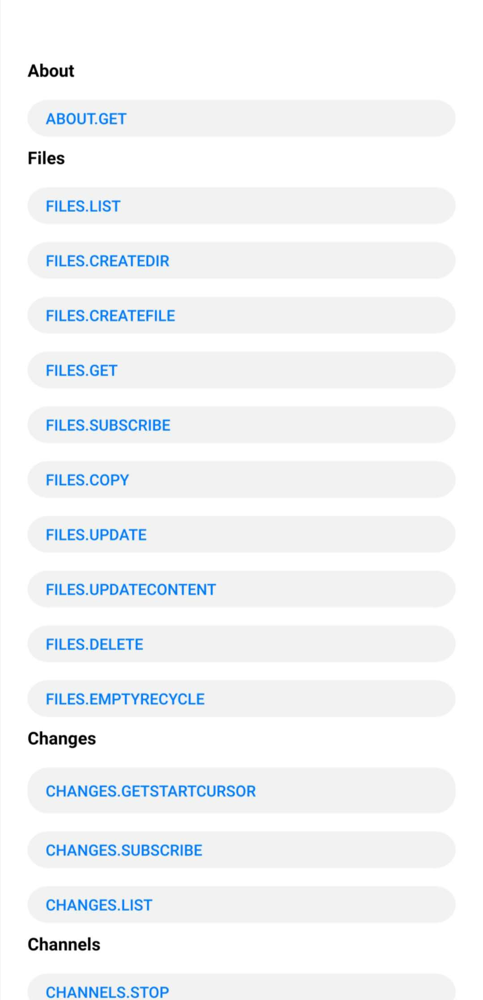

# 华为云空间服务客户端示例代码

  
  
中文 | [English](https://github.com/HMS-Core/hms-drive-clientdemo/blob/master/README.md)

## Table of Contents

 * [简介](#简介)
 * [开发准备](#开发准备)
 * [配置](#配置)
 * [环境要求](#环境要求)
 * [示例代码](#示例代码)
 * [授权许可](#授权许可)

## 简介   
 该示例代码封装华为云空间服务SDK的接口，提供多个示例程序供你参考或使用。你将学习如何使用云空间服务SDK。  
 如下是Java示例代码包。
 
 app：示例代码包。
 
 

## 开发准备   
 更多开发详情，请参见如下链接：
 https://developer.huawei.com/consumer/cn/doc/development/HMSCore-Guides/introduction-0000001050039630   

 使用华为云空间服务SDK示例代码前，需检查Java环境是否已经安装。
 将示例代码复制到本地。
 以Android Studio 3.2为例。云空间服务示例代码的运行步骤如下：
 1.	在AppGallery Connect中创建应用，获取agconnect-services.json文件，并将文件添加到你的项目中。  
 2.	你还需生成签名证书指纹并将证书文件添加到你的项目中，然后在build.gradle文件中添加配置。  
 请参见“AppGallery Connect配置”在AppGallery Connect中配置应用信息。  
 3.	在Android Studio中，选择File > Open。在弹框中，输入示例代码的本地存储路径，例如D:\HuaweiDriveSDK\samples\HuaweiDriveSample-4.0.3.300。  
 4.	选中待打开的HuaweiDriveSample项目，然后点击“确认”。在弹框中，选择New Window在新窗口中打开项目。  
 5.	在Android Studio中，点击“Run”，选择你的设备作为目标设备，点击“确认”在你的设备上启动示例应用。  

## 配置
 build.gradle和agconnect-services.json文件中参数如下所示：  
 
 applicationId：在华为开发者联盟上注册的申请ID。  
 app_id：应用ID，从应用信息中获取。
 
 测试应用的设备：EMUI 10.0及以上的华为手机或Android 10.0 及以上的非华为手机。
 如果同时使用多个HMS Core的服务，则需要使用各个Kit对应的最大值。

## 环境要求   
 推荐使用Java 1.8.211及以上版本。  
 推荐使用Android Studio 3.X及以上版本。
 
 您的应用应满足以下条件：
 minSdkVersion 29 
 targetSdkVersion 33 
 compileSdkVersion 30
 Gradle 3.5.4及以上。

## 示例代码  
 目前，云空间服务的核心能力包括文件上传、下载、删除、丢弃和查询，以及文件变更的查询和监控。
 1.	提前获取每个Java文件中主要功能的参数。例如，通过HMS SDK获取Access Token.
 2.	调用所需的接口。一些接口彼此存在依赖关系，例如：
  调用FILES.CREAEFILE接口前，你需要调用FILES.CREATE接口。  
  调用FILES.GET、FILES.SUBSCRIBE、FILES.COPY、FILES.UPDATE、FILES.UPDATECONTENT、CHANGES.SUBSCRIBE、COMMENTS.CREATE、COMMENTS.LIST接口前，你需要调用FILES.CREATE和FILES.CREATEFILE接口。  
  调用CHANNELS.STOP接口前，你需要调用CHANGES.SUBSCRIBE接口。  
  调用COMMENTS.GET接口前，你需要调用COMMENTS.CREATE接口。  
  调用Replies.CREATE接口前，你需要调用COMMENTS.CREATE接口。  

## 技术支持
如果您对HMS Core还处于评估阶段，可在[Reddit社区](https://www.reddit.com/r/HuaweiDevelopers/)获取关于HMS Core的最新讯息，并与其他开发者交流见解。

如果您对使用HMS示例代码有疑问，请尝试：
- 开发过程遇到问题上[Stack Overflow](https://stackoverflow.com/questions/tagged/huawei-mobile-services)，在`huawei-mobile-services`标签下提问，有华为研发专家在线一对一解决您的问题。
- 到[华为开发者论坛](https://developer.huawei.com/consumer/cn/forum/blockdisplay?fid=18) HMS Core板块与其他开发者进行交流。

如果您在尝试示例代码中遇到问题，请向仓库提交[issue](https://github.com/HMS-Core/hms-drive-clientdemo/issues)，也欢迎您提交[Pull Request](https://github.com/HMS-Core/hms-drive-clientdemo/pulls)。

## 授权许可
 云空间服务SDK示例代码经过[Apache License, version 2.0](http://www.apache.org/licenses/LICENSE-2.0)授权许可.
